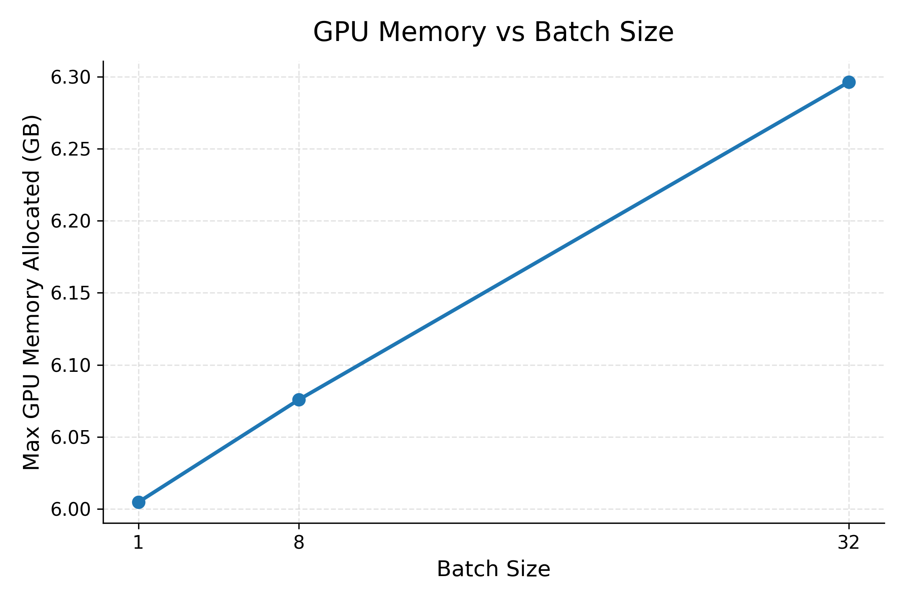

# LLM Inference Bench

`llm-inference-bench` is an ML systems benchmark project for studying LLM inference performance. The current experiment is a controlled FP16 batch-scaling baseline for `meta-llama/Llama-3.2-3B-Instruct` using HuggingFace Transformers on a CUDA GPU in Google Colab.

The benchmark measures how batch size affects throughput, latency, and GPU memory usage before introducing additional optimization techniques such as quantization or specialized serving engines.

## Motivation

LLM inference performance is shaped by a throughput-latency tradeoff. Larger batches can improve GPU utilization and increase aggregate tokens per second, but they can also increase per-batch latency as the workload approaches hardware or runtime limits.

This project establishes a clean FP16 baseline first, using fixed prompts, repeatable settings, raw CSV outputs, and publication-style plots. That baseline provides a reference point for future experiments with INT8, INT4, vLLM, and time-to-first-token measurements.

## Benchmark Methodology

The benchmark runs deterministic generation over a fixed prompt set. For each batch size, it performs warmup generation, then runs multiple timed passes over the prompt set. Each timed batch records latency, generated token count, throughput, prompt length, output length, and CUDA memory statistics.

The matrix runner loads the model once and evaluates batch sizes in increasing order. Each batch size writes its CSV immediately after completion, so completed results are preserved even if a later, larger batch size runs out of memory.

## Experiment Setup

| Setting | Value |
| --- | --- |
| Model | `meta-llama/Llama-3.2-3B-Instruct` |
| Precision | FP16 |
| Backend | HuggingFace Transformers |
| Hardware | CUDA GPU on Google Colab |
| Batch sizes | 1, 8, 32 |
| Prompt set | 30 fixed prompts |
| Runs | 5 |
| Warmup runs | 1 |
| Max new tokens | 32 |

## Repo Structure

```text
llm-inference-bench/
|-- data/
|   `-- prompts.json
|-- outputs/
|   |-- fp16_aggregated_metrics.csv
|   |-- fp16_throughput_vs_batch.png
|   |-- fp16_mean_latency_vs_batch.png
|   |-- fp16_p95_latency_vs_batch.png
|   `-- fp16_memory_vs_batch.png
|-- scripts/
|   |-- generate_prompts.py
|   |-- run_experiment_matrix.py
|   |-- plot_results.py
|   `-- run_benchmark.py
|-- src/
|   |-- benchmark.py
|   |-- config.py
|   |-- metrics.py
|   |-- model_loader.py
|   `-- results.py
|-- README.md
|-- WRITEUP.md
`-- requirements.txt
```

## Setup

Use Python 3.10+.

```bash
python -m venv venv
source venv/bin/activate
pip install -r requirements.txt
```

Generate the fixed 30-prompt set:

```bash
python scripts/generate_prompts.py
```

The Llama model is gated on HuggingFace. Accept the model license and authenticate before running the full experiment:

```bash
huggingface-cli login
```

## Dry Run

The matrix script includes a dry-run mode for validating configuration and output paths. It uses 3 prompts, 1 timed run, no warmup, `max_new_tokens=8`, and TinyLlama by default:

```bash
python scripts/run_experiment_matrix.py --dry-run
```

Dry-run outputs are written to `outputs/dry_run_fp16_batch*.csv` so they do not overwrite full experiment outputs.

## Full FP16 Matrix on Colab GPU

Run the full experiment on a Colab GPU runtime:

```bash
python scripts/run_experiment_matrix.py
```

This writes:

- `outputs/fp16_batch1.csv`
- `outputs/fp16_batch8.csv`
- `outputs/fp16_batch32.csv`

Batch size 32 may run out of memory on smaller GPUs. If that happens, completed CSV files from earlier batch sizes are left in place.

## Generate Plots

After the FP16 matrix CSVs exist, generate aggregate metrics and plots:

```bash
python scripts/plot_results.py
```

This writes:

- `outputs/fp16_aggregated_metrics.csv`
- `outputs/fp16_throughput_vs_batch.png`
- `outputs/fp16_mean_latency_vs_batch.png`
- `outputs/fp16_p95_latency_vs_batch.png`
- `outputs/fp16_memory_vs_batch.png`

## Results

| Batch Size | Mean Latency | P95 Latency | Throughput | Max GPU Memory Allocated |
| ---: | ---: | ---: | ---: | ---: |
| 1 | 1.2032 s | 1.4952 s | 26.8496 tokens/sec | 6.0047 GB |
| 8 | 1.3151 s | 1.4304 s | 185.8075 tokens/sec | 6.0758 GB |
| 32 | 2.2154 s | 2.2212 s | 433.3367 tokens/sec | 6.2963 GB |




## Key Findings

- Batch size 8 substantially improves throughput over batch size 1 while keeping latency nearly stable.
- Batch size 32 achieves the highest throughput, but latency increases clearly from about 1.3 seconds to about 2.2 seconds.
- The results show a throughput-latency tradeoff: batching improves aggregate throughput, but larger batches eventually add latency.
- GPU memory increases modestly, from about 6.00 GB at batch size 1 to about 6.30 GB at batch size 32.
- For this workload, batching improves GPU utilization without proportional memory growth.

## Limitations

- This is an FP16 HuggingFace Transformers baseline, not a full production serving benchmark.
- The experiment uses a fixed 30-prompt set and `max_new_tokens=32`; longer outputs and more diverse workloads may behave differently.
- Colab GPU hardware can vary across sessions, so results should be treated as a reproducible baseline for this setup rather than universal hardware numbers.
- The benchmark reports full generation latency, but does not yet separate prefill, decode, queueing delay, or time to first token.
- It does not model multi-user traffic, request scheduling, service-level objectives, or sustained production load.

## Future Work

- Add TTFT measurement.
- Add INT8 and INT4 quantization experiments.
- Add vLLM backend support.
- Compare prefill and decode timing separately.
- Test larger prompt sets and longer generation lengths.
- Compare additional GPU types and serving configurations.
