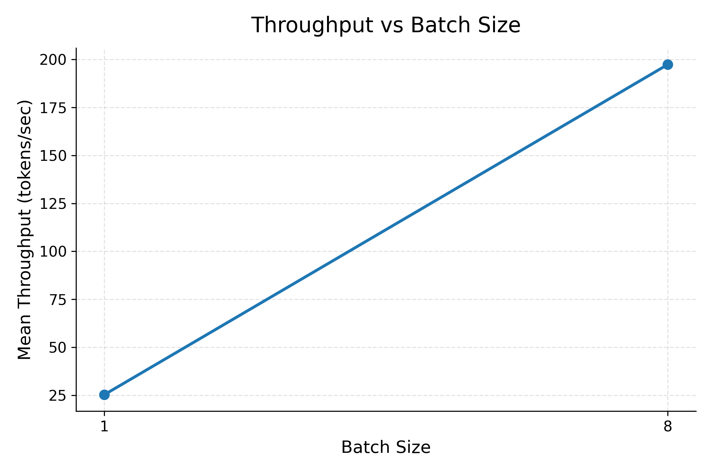
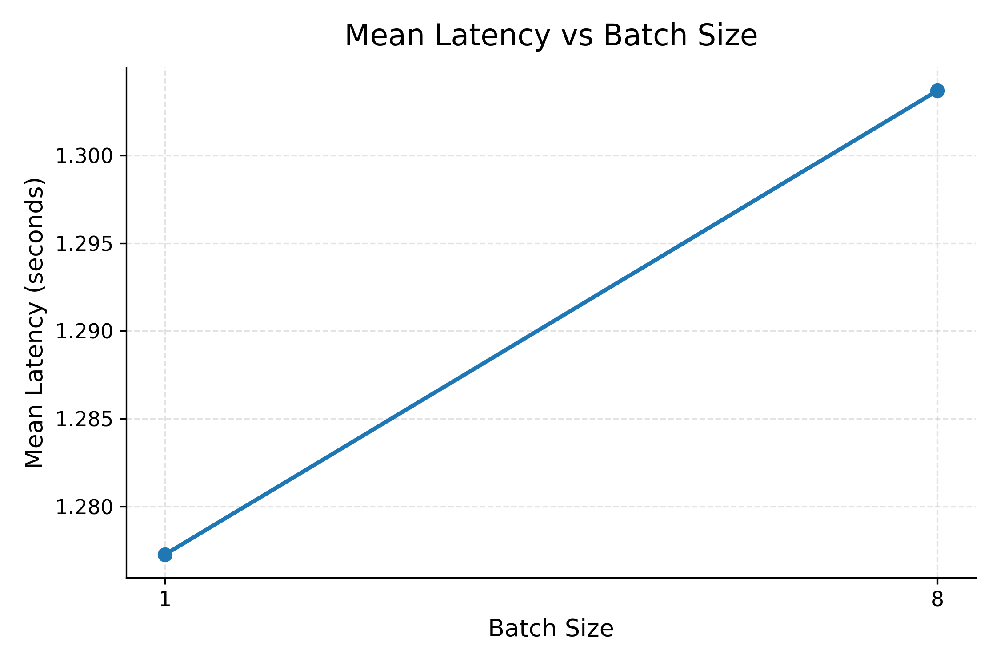
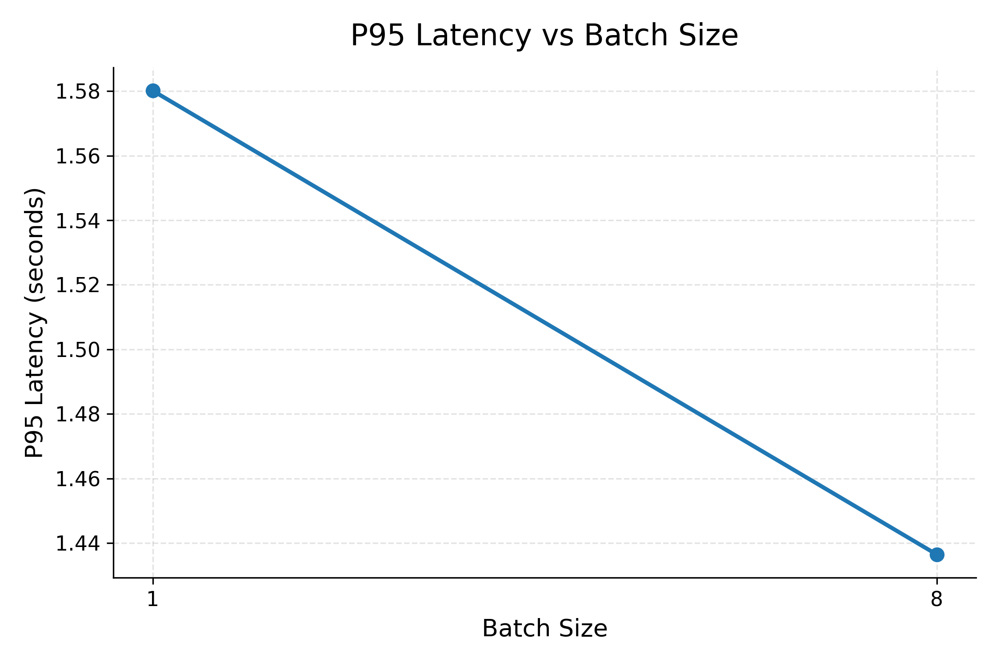

# LLM Inference Batch Size Benchmark

## Motivation

Efficient LLM inference requires balancing latency and throughput. Small batch sizes can provide simple request handling and low per-request delay, but they may underutilize GPU compute. Larger batch sizes can improve aggregate throughput by keeping the GPU busier, but they can also increase latency depending on the model, workload, and serving system.

This project establishes an initial FP16 baseline for `meta-llama/Llama-3.2-3B-Instruct` using HuggingFace Transformers on a Colab CUDA GPU. The goal is not to fully model production serving behavior yet, but to create a reproducible starting point for comparing batch sizes and future optimization work.

## Experimental Setup

The benchmark compares two batch sizes:

- Batch size 1
- Batch size 8

Each configuration used:

- Model: `meta-llama/Llama-3.2-3B-Instruct`
- Precision: FP16
- Backend: HuggingFace Transformers
- Device: CUDA GPU in Google Colab
- Prompt count: 8 prompts
- Timed runs: 3
- Maximum new tokens: 32
- Warmup runs: 2

The benchmark records per-prompt and per-batch measurements to CSV, then aggregates latency and throughput by batch size.

## Model and Hardware

The model under test is `meta-llama/Llama-3.2-3B-Instruct`, a 3B-parameter instruction-tuned Llama model. The benchmark loads the model through HuggingFace Transformers and uses FP16 inference when CUDA is available.

The successful benchmark runs were performed on a Colab GPU runtime. Colab GPU availability can vary across sessions, so these numbers should be interpreted as a baseline from one working Colab GPU setup rather than as universal hardware results.

## Prompt Set

The benchmark uses a fixed prompt set generated by `scripts/generate_prompts.py` and stored in `data/prompts.json`. For this batch comparison, the first 8 prompts were used. The prompts are short systems-oriented tasks such as explaining batching, latency, throughput, and inference benchmarking concepts.

Using a fixed prompt set makes the batch size comparison easier to reproduce, but it also limits the diversity of the workload.

## Metrics

The main metrics are:

- Mean latency: average generation latency in seconds.
- P95 latency: 95th percentile generation latency in seconds.
- Throughput: generated tokens per second.

The raw CSVs also include generated token counts, prompt token lengths, output token lengths, and CUDA memory fields.

## Methodology

For each batch size, the benchmark:

1. Loads the model and tokenizer.
2. Loads the fixed prompt set.
3. Runs warmup generations before timed measurement.
4. Runs 3 timed passes over the selected prompts.
5. Measures generation latency and generated-token throughput.
6. Writes raw measurements to CSV.
7. Aggregates results by batch size.
8. Generates matplotlib plots for throughput, mean latency, and p95 latency.

The commands used for the final benchmark were:

```bash
python scripts/run_benchmark.py \
  --model meta-llama/Llama-3.2-3B-Instruct \
  --batch-size 1 \
  --num-runs 3 \
  --warmup-runs 2 \
  --max-new-tokens 32 \
  --limit-prompts 8 \
  --output outputs/benchmark_results_b1.csv
```

```bash
python scripts/run_benchmark.py \
  --model meta-llama/Llama-3.2-3B-Instruct \
  --batch-size 8 \
  --num-runs 3 \
  --warmup-runs 2 \
  --max-new-tokens 32 \
  --limit-prompts 8 \
  --output outputs/benchmark_results_b8.csv
```

Plots and aggregate metrics were generated with:

```bash
python scripts/plot_results.py
```

## Results

| Batch Size | Mean Latency | P95 Latency | Throughput |
| ---: | ---: | ---: | ---: |
| 1 | 1.2773 s | 1.5802 s | 25.3276 tokens/sec |
| 8 | 1.3037 s | 1.4364 s | 197.3477 tokens/sec |







## Analysis

The main finding is that increasing batch size from 1 to 8 improved aggregate throughput by almost 8x, from 25.3276 tokens/sec to 197.3477 tokens/sec. Mean latency stayed roughly stable, changing from 1.2773 seconds at batch size 1 to 1.3037 seconds at batch size 8.

This behavior is consistent with the expected batching tradeoff for a small GPU inference workload. With batch size 1, the GPU has less work to process per generation call and can be underutilized. With batch size 8, more prompts are processed together, which better uses GPU parallelism and improves total tokens generated per second.

For this specific workload, the latency cost of batching was small. The p95 latency was also slightly lower for batch size 8 in this run, though that should not be overinterpreted because the experiment uses only 8 prompts and 3 timed runs. The stronger conclusion is that throughput improved substantially while latency remained near 1.3 seconds.

These results are best viewed as an FP16 baseline for controlled batch comparison, not as a full production serving benchmark. A production benchmark would need more requests, concurrent clients, queueing behavior, time-to-first-token measurements, multiple output lengths, and more hardware coverage.

## Limitations

- The benchmark uses only 8 prompts for the batch comparison.
- Each configuration uses 3 timed runs, which is enough for a small baseline but not for robust statistical characterization.
- The workload uses a fixed `max_new_tokens=32`, so it does not cover longer generations.
- The benchmark measures full generation latency but does not yet separate prefill, decode, and time to first token.
- The backend is HuggingFace Transformers only; optimized serving stacks such as vLLM are not included yet.
- Colab GPU hardware can vary, so results may differ across sessions.
- The benchmark does not model production traffic, request queues, multi-user concurrency, or service-level objectives.

## Future Work

- Add INT8 inference benchmarks.
- Add INT4 inference benchmarks.
- Add vLLM backend support for optimized serving comparisons.
- Measure time to first token (TTFT).
- Separate prefill and decode timing.
- Test larger prompt sets and longer output lengths.
- Compare results across GPU types.
- Add concurrency and request queueing benchmarks.
