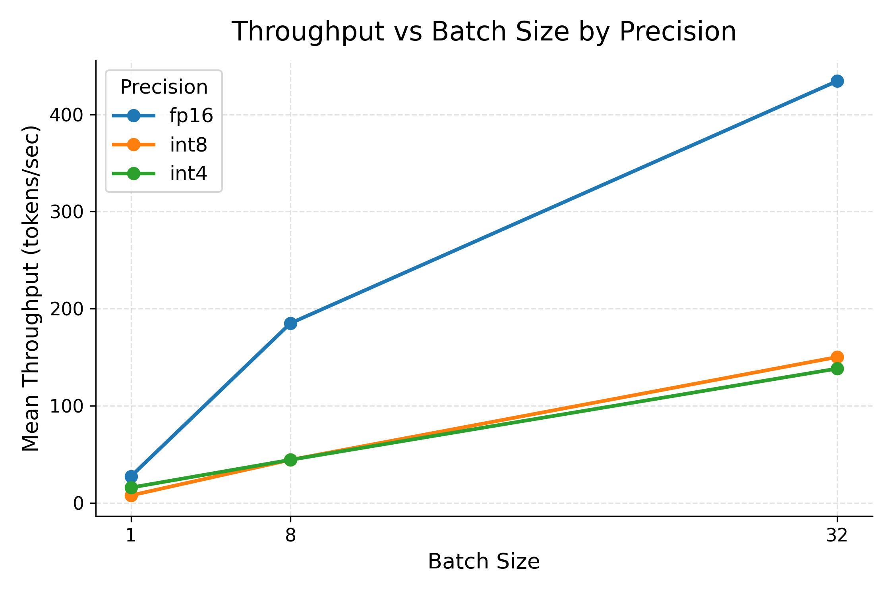
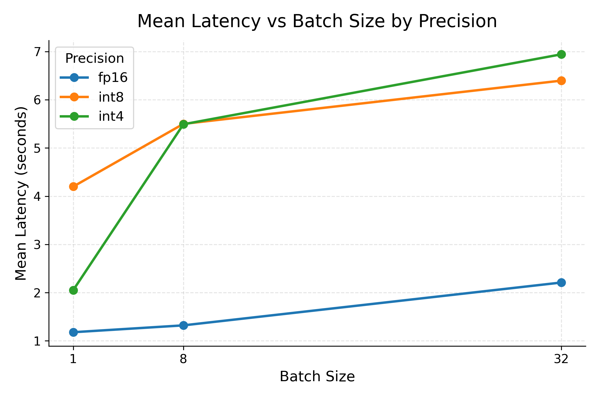
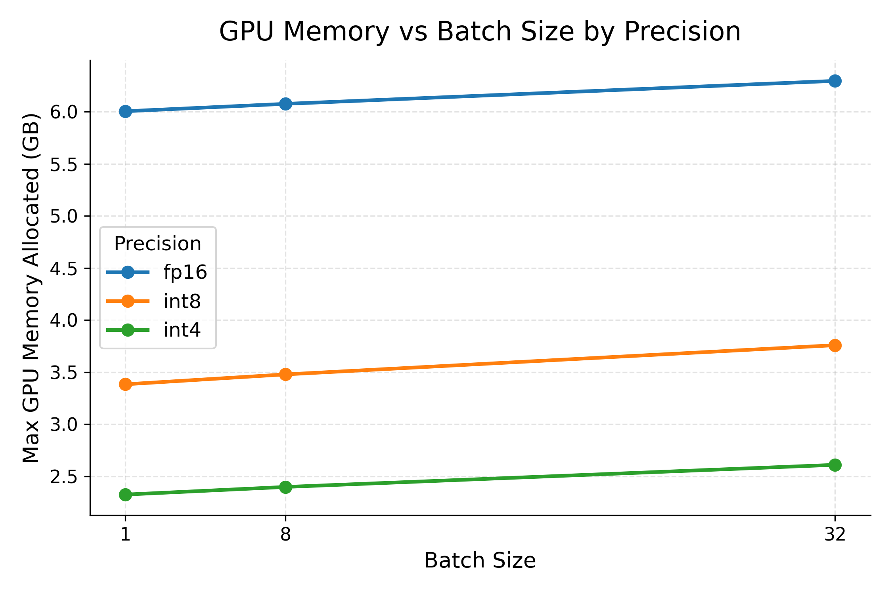
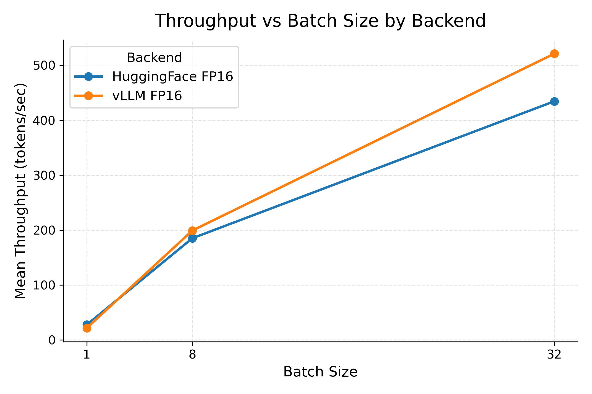
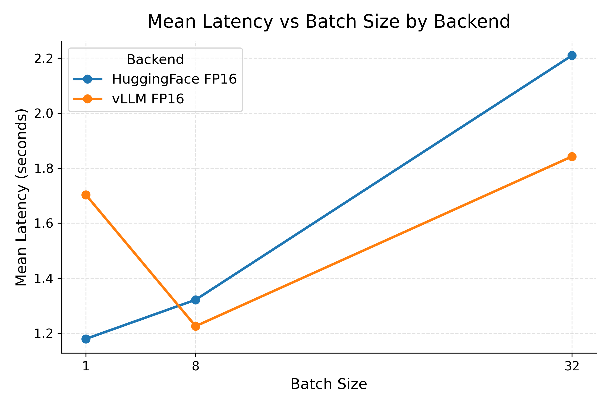
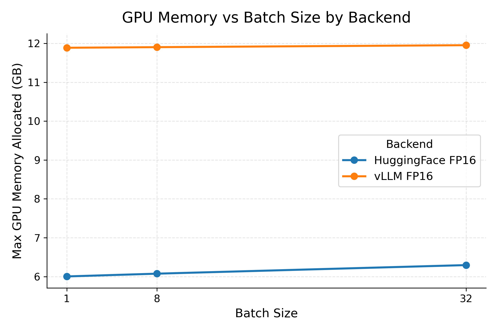

# Precision and Batch Scaling for Llama Inference

## Motivation

LLM inference performance depends on both batching and numeric precision. Batching can improve aggregate throughput by giving the GPU more work per generation call. Quantization can reduce memory requirements, which may enable larger models, larger batches, or cheaper hardware. These optimizations are often discussed together, but they do not guarantee the same outcome.

This project evaluates FP16, INT8, and INT4 inference for `meta-llama/Llama-3.2-3B-Instruct` using HuggingFace Transformers and bitsandbytes on a Colab CUDA GPU. It also compares the HuggingFace FP16 path against a vLLM FP16 backend. The goal is to establish a measured baseline for throughput, latency, and memory before adding production-serving features such as TTFT and concurrency.

## Experimental Design

The first experiment evaluates a 3 x 3 precision matrix:

- Precisions: FP16, INT8, INT4
- Batch sizes: 1, 8, 32

Each configuration uses the same prompt set, generation length, backend, and run count. The matrix runner loads the model once per precision and evaluates batch sizes in increasing order. Each completed configuration is written to CSV immediately.

The second experiment compares FP16 backend implementations:

- HuggingFace Transformers FP16
- vLLM FP16

The vLLM path uses the same model, prompt set, batch sizes, run count, warmup count, and generation length.

## Model and Hardware

| Component | Value |
| --- | --- |
| Model | `meta-llama/Llama-3.2-3B-Instruct` |
| Backends | HuggingFace Transformers, vLLM |
| Quantization | bitsandbytes for INT8 and INT4 |
| Hardware | CUDA GPU on Google Colab |
| Max new tokens | 32 |

The exact Colab GPU can vary between sessions, so the results should be treated as a controlled baseline for this environment rather than as universal hardware numbers.

## Prompt Set

The benchmark uses 30 fixed prompts generated by `scripts/generate_prompts.py` and stored in `data/prompts.json`.

The prompt set contains:

- 10 short prompts
- 10 medium prompts
- 10 long prompts

Each prompt item includes an `id`, `category`, and `prompt`. Keeping the prompts fixed makes the comparison focus on precision and batch size rather than changing input data.

## Metrics

The experiment reports:

- Mean latency: average measured generation latency in seconds.
- P95 latency: 95th percentile generation latency in seconds.
- Throughput: generated tokens per second.
- Max GPU memory allocated: maximum CUDA memory allocated during measured batches.

The raw CSV outputs also include prompt index, generated token count, prompt length, output length, and reserved GPU memory.

## Methodology

For each precision, the benchmark:

1. Loads `meta-llama/Llama-3.2-3B-Instruct`.
2. Runs batch sizes 1, 8, and 32.
3. Performs 1 warmup pass before timed measurement.
4. Runs 5 timed passes over all 30 prompts.
5. Uses `max_new_tokens=32`.
6. Saves each precision and batch-size CSV immediately.
7. Aggregates metrics by precision and batch size.
8. Generates throughput, latency, and memory plots.

The full matrix command is:

```bash
python scripts/run_quantization_matrix.py
```

The plotting command is:

```bash
python scripts/plot_results.py
```

Generated aggregate artifacts:

- `outputs/precision_aggregated_metrics.csv`
- `outputs/precision_throughput_vs_batch.png`
- `outputs/precision_latency_vs_batch.png`
- `outputs/precision_memory_vs_batch.png`
- `outputs/backend_aggregated_metrics.csv`
- `outputs/backend_throughput_vs_batch.png`
- `outputs/backend_latency_vs_batch.png`
- `outputs/backend_memory_vs_batch.png`

## Results

### Precision Matrix

| Precision | Batch Size | Mean Latency | P95 Latency | Throughput | Max GPU Memory |
| --- | ---: | ---: | ---: | ---: | ---: |
| FP16 | 1 | 1.1793 s | 1.4457 s | 27.3510 tok/s | 6.0047 GB |
| FP16 | 8 | 1.3215 s | 1.5181 s | 184.9648 tok/s | 6.0758 GB |
| FP16 | 32 | 2.2097 s | 2.2288 s | 434.4513 tok/s | 6.2963 GB |
| INT8 | 1 | 4.1999 s | 4.6472 s | 7.6495 tok/s | 3.3836 GB |
| INT8 | 8 | 5.5006 s | 5.9852 s | 44.2865 tok/s | 3.4788 GB |
| INT8 | 32 | 6.3974 s | 6.6735 s | 150.2164 tok/s | 3.7589 GB |
| INT4 | 1 | 2.0525 s | 2.4902 s | 15.7128 tok/s | 2.3250 GB |
| INT4 | 8 | 5.4925 s | 5.6064 s | 44.3022 tok/s | 2.3983 GB |
| INT4 | 32 | 6.9431 s | 6.9532 s | 138.2671 tok/s | 2.6105 GB |







### Backend Comparison

| Backend | Batch Size | Mean Latency | P95 Latency | Throughput | Max GPU Memory |
| --- | ---: | ---: | ---: | ---: | ---: |
| HuggingFace FP16 | 1 | 1.1793 s | 1.4457 s | 27.3510 tok/s | 6.0047 GB |
| HuggingFace FP16 | 8 | 1.3215 s | 1.5181 s | 184.9648 tok/s | 6.0758 GB |
| HuggingFace FP16 | 32 | 2.2097 s | 2.2288 s | 434.4513 tok/s | 6.2963 GB |
| vLLM FP16 | 1 | 1.7032 s | 2.6746 s | 21.3900 tok/s | 11.8872 GB |
| vLLM FP16 | 8 | 1.2255 s | 1.2740 s | 198.9600 tok/s | 11.9024 GB |
| vLLM FP16 | 32 | 1.8425 s | 1.8843 s | 521.1701 tok/s | 11.9527 GB |







## Analysis

### Quantization Tradeoffs

Batch scaling improves throughput across all precision modes. The exact gains differ by precision, but the overall shape is consistent: larger batches give the GPU more work per generation call, so aggregate tokens per second rises from batch size 1 to batch size 32. This holds even for INT8 and INT4, where the quantized execution path is slower overall.

FP16 is the fastest precision in this experiment. It has the highest throughput at every batch size and the lowest latency at batch sizes 8 and 32. Under this HuggingFace Transformers and bitsandbytes setup, INT8 and INT4 reduce allocated memory but slow generation.

The batch-size tradeoff is still visible within each precision. Batch size 32 gives the highest throughput, but latency increases compared with smaller batches. For batch size 32, p95 latency remains close to mean latency in all three precision modes, indicating stable but slower batch execution rather than highly variable tail behavior.

INT4 is faster than INT8 at batch size 1, but INT8 and INT4 are similar at batch sizes 8 and 32. This suggests bitsandbytes overhead and kernel behavior vary by batch size.

The memory results show the expected advantage of quantization. At batch size 32, FP16 allocates 6.2963 GB, INT8 allocates 3.7589 GB, and INT4 allocates 2.6105 GB. INT4 uses the least memory overall.

Backend implementation matters. Quantization changes the memory footprint and arithmetic path, but speed depends on kernel support, dequantization overhead, model architecture, batch size, and the serving stack. These results should not be read as a claim that quantization universally reduces throughput, or that FP16 is always faster in every backend. They show what happened in this specific HuggingFace Transformers plus bitsandbytes baseline.

### Backend Tradeoffs

The backend comparison shows that vLLM FP16 scales better at larger batch sizes. HuggingFace FP16 is faster at batch size 1, with 27.3510 tok/s versus 21.3900 tok/s for vLLM. At batch size 8, vLLM slightly leads at 198.9600 tok/s versus 184.9648 tok/s. At batch size 32, the gap is larger: vLLM reaches 521.1701 tok/s while HuggingFace reaches 434.4513 tok/s.

This pattern is consistent with vLLM's serving-oriented design. vLLM is built around mechanisms such as PagedAttention and continuous batching, which are intended to improve memory management and scheduling as more requests are processed together. vLLM introduces higher scheduling and initialization overhead at small batch sizes, but these fixed costs are amortized at larger batch sizes, allowing throughput advantages to emerge at batch size 32.

The memory tradeoff is also clear. vLLM allocates about 11.95 GB at batch size 32, compared with about 6.30 GB for HuggingFace FP16. vLLM reserves GPU memory upfront for KV cache management (`gpu_memory_utilization=0.9`), which increases apparent memory usage but reduces runtime allocation overhead and improves serving efficiency at larger batch sizes.

### Key Findings

#### Quantization Is a Memory Optimization, Not a Throughput Optimization

The clearest unexpected result is that INT8 and INT4 reduced memory substantially but did not improve throughput. At batch size 32, allocated memory dropped from about 6.30 GB with FP16 to about 3.76 GB with INT8 and about 2.61 GB with INT4.

Throughput moved in the opposite direction. FP16 reached about 434 tok/s at batch size 32, while INT8 reached about 150 tok/s and INT4 reached about 138 tok/s.

This suggests that bitsandbytes quantization in this setup is primarily a memory optimization, not a serving-throughput optimization. Quantization may still be valuable when memory is the limiting constraint, but it should be benchmarked rather than assumed to improve speed.

When memory is the bottleneck, INT4 is a clear win. When throughput is the bottleneck and memory is sufficient, FP16 is the better choice in this backend.

#### vLLM Improves Large-Batch Throughput at Higher Memory Cost

vLLM is not faster for the smallest batch in this benchmark, but it overtakes HuggingFace FP16 at batch sizes 8 and 32. The larger batch results are the more relevant signal for serving-oriented workloads, where scheduling and memory-management overhead can be amortized across more prompts.

## Limitations

- This is a HuggingFace Transformers, bitsandbytes, and vLLM baseline, not a full production serving benchmark.
- Colab GPU hardware can vary between sessions.
- The experiment uses 30 fixed prompts and `max_new_tokens=32`.
- The benchmark measures full generation latency, not TTFT.
- Prefill and decode timing are not separated.
- The experiment does not model streaming, request queues, multi-user concurrency, or service-level objectives.
- Results may differ with other kernels, GPUs, longer outputs, or different model sizes.

## Future Work

- Measure time to first token (TTFT).
- Add concurrent request and sustained-load benchmarks.
- Separate prefill and decode timing.
- Evaluate longer output lengths and larger prompt sets.
- Compare additional GPU types and serving configurations.
